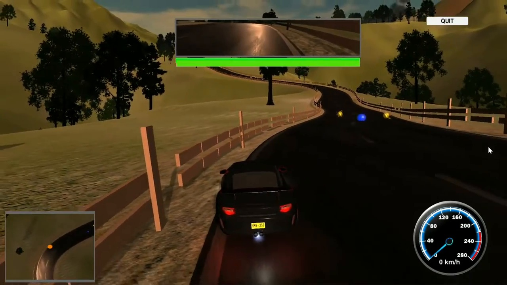
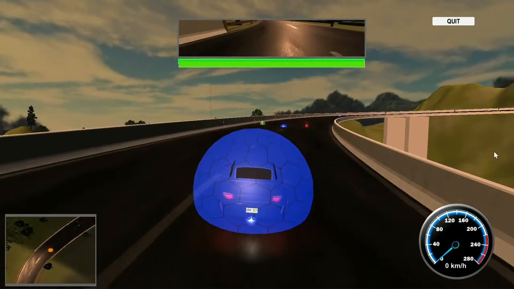
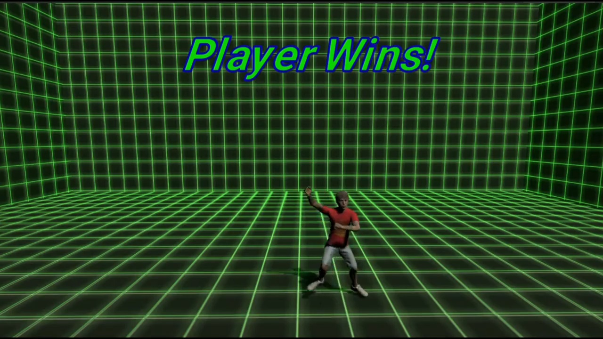
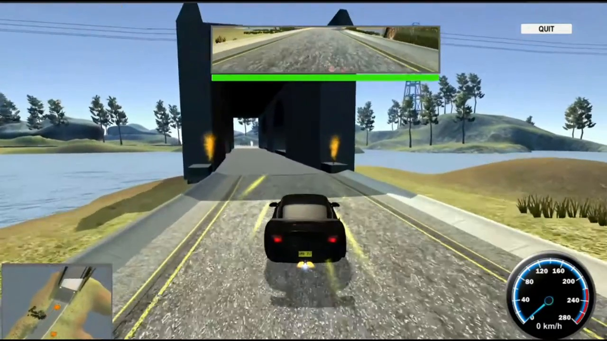
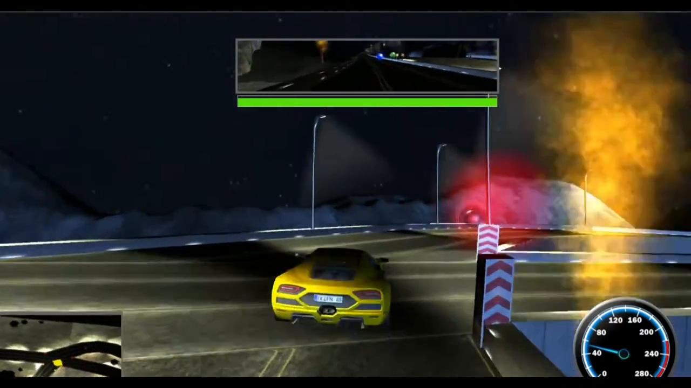
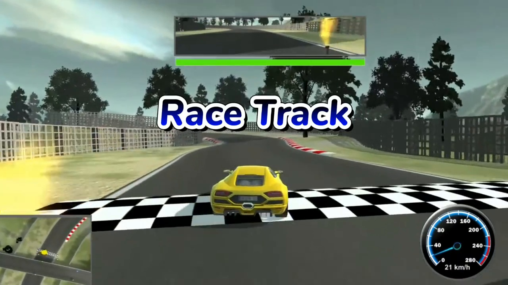

# VelocityRush

<p align="center">
  
</p>

**VelocityRush** is a Unity multiplayer arcade racing game built around competitive racing, vehicle combat, power-ups, checkpoints, and networked player sessions.

This repository is presented as a source-code portfolio highlighting multiplayer and gameplay programming in C#.

## Gameplay Screenshots

<table>
  <tr>
    <td width="50%"></td>
    <td width="50%"></td>
  </tr>
  <tr>
    <td width="50%"></td>
    <td width="50%"></td>
  </tr>
  <tr>
    <td width="50%"></td>
    <td width="50%"></td>
  </tr>
</table>

## Technical Highlights

- Multiplayer lobby and room flow using Photon PUN
- Local/remote player setup and control separation
- Vehicle movement using Unity Wheel Colliders
- Multiplayer race and player spawning logic
- Sequential checkpoint and lap tracking
- Checkpoint-based respawning and vehicle reset
- EMP, nitro, shield, and health power-up systems
- Vehicle health and combat-related gameplay
- Camera, audio, UI, and race-state support systems

## Multiplayer Flow

```text
Connect to Photon
      ↓
Enter Player Name
      ↓
Create / Join Room
      ↓
Lobby & Ready State
      ↓
Map / Vehicle Selection
      ↓
Spawn Network Players
      ↓
Multiplayer Race
```

Photon PUN is used for the multiplayer layer. Players connect to the Photon service, create or join rooms, enter the lobby flow, and participate in networked races. Player setup logic ensures that local gameplay controls are enabled only for the locally owned vehicle while remote vehicles remain network-controlled.

## Vehicle System

The vehicle controller uses Unity's Wheel Collider system for steering, motor torque, braking, suspension, and wheel behaviour. Supporting systems handle camera following, engine audio, brake-state behaviour, vehicle reset, and race interactions.

## Race Progression

The checkpoint system validates progression through the track in the correct sequence. Race logic tracks checkpoint progress and laps while the respawn system allows a vehicle to return to its latest valid checkpoint with the appropriate position and orientation.

## Power-Ups & Combat

VelocityRush includes several gameplay modifiers:

- **EMP** — temporarily disrupts vehicle control.
- **Nitro** — provides a temporary acceleration boost after collection.
- **Shield** — protects the vehicle from EMP effects.
- **Health** — restores vehicle health.

These systems combine collectible state, vehicle behaviour, collision/trigger handling, and gameplay feedback.

## Code Areas Worth Reviewing

| Area | Representative Scripts |
| --- | --- |
| Vehicle physics | `CarController.cs` |
| Race progression | `LapController.cs`, `CheckpointSingle.cs` |
| Respawning | `CheckpointRespawnPointController.cs` |
| Multiplayer race logic | multiplayer/racing manager and player setup scripts |
| EMP gameplay | `EmpController.cs`, `EmpPowerup.cs` |
| Health gameplay | `HealthBar.cs`, `HealthPowerup.cs` |
| Vehicle presentation | `CameraFollow.cs`, `CarEngineSoundController.cs` |

## Technologies

- Unity
- C#
- Photon PUN
- Unity Physics / Wheel Colliders
- Multiplayer networking
- Unity UI

## Project Focus

This project demonstrates practical implementation of multiplayer game flow, network-aware player control, vehicle physics, race progression, gameplay state, power-ups, and reusable Unity C# systems.

## Media

- Trailer: [Google Drive](https://drive.google.com/file/d/1UXttvCqBVvpLx0fnxxnVZ_Qx0T7Ea5Bs/view?usp=sharing)
- Gameplay Walk-Through: [Google Drive](https://drive.google.com/file/d/16GSvmmZ5wfZzOeSr1owLMsQaqIeFvaBg/view?usp=sharing)

## Repository Note

This repository is maintained as a technical portfolio showcase. It focuses on selected source code and programming systems rather than distributing a complete production build or third-party packages.
